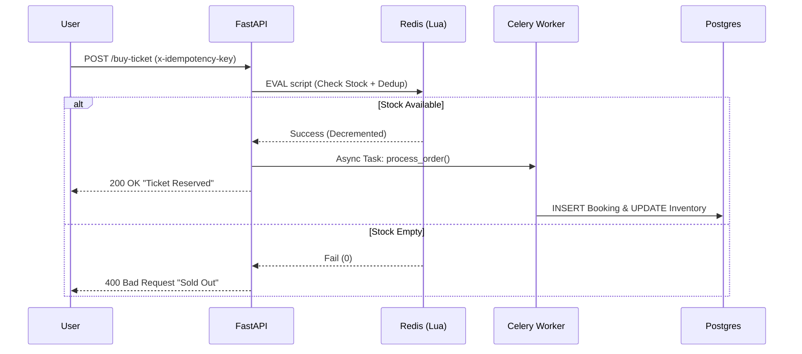

# 🎟️ AtomicTickets: A production-grade race-condition lab for flash-sale systems

[](https://fastapi.tiangolo.com)
[](https://redis.io/)
[](https://www.postgresql.org/)
[](https://docs.celeryq.dev/)
[](https://www.docker.com/)

> **A distributed system simulation demonstrating how to prevent race conditions in high-demand flash-sale-systems using Redis Atomic Locks and Lua scripting.**

---

## ⚡ The Challenge: The "Double Booking" Problem

In high-concurrency environments (like ticket sales or flash drops), standard database transactions are too slow to prevent **Race Conditions**.

When 100 users try to buy the **last ticket** at the exact same millisecond:

1.  All 100 requests read `tickets_left = 1`.
2.  All 100 requests pass the check `if tickets_left > 0`.
3.  All 100 requests decrement the count and write to the DB.
4.  **Result:** You sold 100 tickets, but you only had 1. The event is oversold.

This project demonstrates both the **Failure** (Naive approach) and the **Solution** (Atomic approach) side-by-side.

---

## Why This Matters

High-demand product launches (e.g., PS5 restocks) have famously overwhelmed retailer systems due to massive concurrent traffic, leading to crashes, rapid sell-outs, and frustrated customers : a classic example of why properly handling race conditions matters

This project simulates those real-world failures and fixes them properly.

---

## 🛠️ The Solution: Atomic Locking Architecture

To fix this, we move the state management to the **Speed Layer (Redis)** and use **Lua Scripts** to enforce atomicity.

### System Architecture



# Key Technical Features

-   **Atomic Transactions (Lua)**  
    The "Check Stock" and "Decrement Stock" operations run inside a single, indivisible Redis Lua script. No other command can interrupt it during execution.

-   **Idempotency Keys**  
    Prevents double charging if a user clicks twice or the network retries. Redis caches the unique request ID to reject replay attempts.

-   **Event-Driven Persistence**  
    The API responds instantly (millisecond latency), while Celery workers handle heavy SQL writes in the background (eventual consistency model).

-   **Real-Time Dashboard**  
    JavaScript-based Mission Control (Vanilla JS + Chart.js) to visualize race conditions and latency live.

---

# 🚀 Quick Start

## Prerequisites

-   Docker
-   Docker Compose

## Running the System

### Clone the repo

```bash
git clone https://github.com/parththedev/AtomicTickets.git
cd AtomicTickets
```

### Start the cluster

```bash
docker compose up --build -d
```

### Access Mission Control

Frontend : Open in browser (see api-doc at http://localhost:8000/docs):

```
http://localhost:8000/static/index.html
```

---

# 🧪 The "Blast" Test (Benchmark)

Reproduce race conditions using the built-in dashboard.

## Scenario 1: Failure (Naive Mode)

-   **Logic**  
    Standard PostgreSQL `SELECT -> UPDATE` transaction.

-   **Test**  
    Fire 100 concurrent requests for 10 tickets.

-   **Result**  
    Oversold by 10–20 tickets.  
    Database becomes corrupted due to read-modify-write race conditions.

## Scenario 2: Success (Atomic Mode)

-   **Logic**  
    Redis Lua scripting + async Celery workers.

-   **Test**  
    Fire 100 concurrent requests for 10 tickets.

-   **Result**  
    Exactly 10 tickets sold.  
    90 requests rejected.  
    Zero overselling. Guaranteed consistency.

---

# 📂 Project Structure

```bash
AtomicTickets/
├── alembic/                 # Database migrations
│   ├── env.py
│   ├── README
│   ├── script.py.mako
│   └── versions/

├── src/
│   ├── core/                # App configuration
│   │   └── config.py
│
│   ├── db/                  # Database layer
│   │   ├── models.py
│   │   ├── schemas.py
│   │   └── session.py
│
│   ├── redis/               # Redis client + Lua scripts
│   │   ├── client.py
│   │   └── buy_ticket.lua
│
│   ├── static/              # Dashboard UI
│   │   └── index.html
│
│   ├── worker/              # Celery background workers
│   │   ├── celery_app.py
│   │   └── __init__.py
│
│   ├── routes.py            # API endpoints
│   └── main.py              # FastAPI entrypoint

├── docker-compose.yml
├── Dockerfile
├── alembic.ini
├── pyproject.toml
├── README.md
└── uv.lock
```

### Folder Breakdown

-   **alembic/**  
    Handles schema migrations and version control for PostgreSQL.

-   **src/core/**  
    Centralized app configuration and environment settings.

-   **src/db/**  
    SQLAlchemy models, schemas, and session management.

-   **src/redis/**  
    Redis client and atomic Lua scripts for stock control.

-   **src/static/**  
    Real-time monitoring dashboard (HTML/JS).

-   **src/worker/**  
    Celery background workers for async DB persistence.

-   **src/routes.py**  
    API endpoints (naive vs atomic implementations).

-   **src/main.py**  
    FastAPI app initialization and middleware setup.

-   **Dockerfile / docker-compose.yml**  
    Containerized deployment setup.

-   **pyproject.toml**  
    Dependency and project configuration.

-   **uv.lock**  
    Locked dependency versions for reproducibility.

---

# 👨‍💻 Tech Stack Details

| Component     | Technology            | Role                                 |
| ------------- | --------------------- | ------------------------------------ |
| API Framework | FastAPI (Python 3.12) | High-performance async REST API      |
| Speed Layer   | Redis + Lua           | Atomic locking & inventory tracking  |
| Database      | PostgreSQL            | Permanent record storage & analytics |
| Task Queue    | Celery                | Async background DB processing       |
| ORM           | SQLAlchemy (Async)    | DB interaction & schema management   |
| Frontend      | Vanilla JS + Chart.js | Real-time visualization dashboard    |

---
